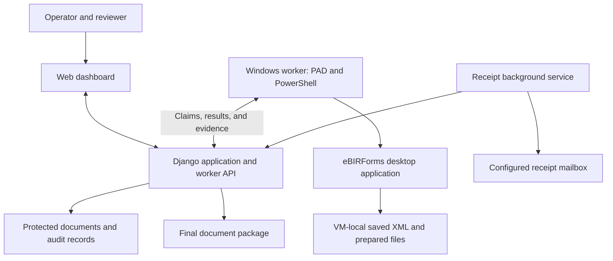

# Controlled Tax Filing Automation

## A white paper on the dashboard, Windows worker, and eBIRForms workflow

**Version:** 1.1  
**Date:** 2 October 2026  
**Audience:** Business owners, accounting operations, reviewers, and technical administrators  
**Basis:** The application source code and operating documentation available at the date above. This paper describes the system design and its implementation scope; it is not an independent certification or a claim of BIR endorsement.

## Executive overview

Tax filing involves more than completing a form. Staff must select the correct taxpayer and period, prepare a return, review it, authorize submission, and retain evidence of the result. When these steps rely on separate desktop sessions, filenames, emails, and manual handoffs, it becomes difficult to establish which return was reviewed and what happened after submission.

This system coordinates those activities through a web dashboard and a dedicated Windows automation worker. The dashboard manages clients, filing work orders, review documents, approvals, and history. Power Automate Desktop (PAD) operates eBIRForms on the Windows machine. A background service checks for matching receipt emails and supports the final document package.

The design separates preparation from submission. Preparing a return does not authorize filing it. A human approval is associated with a particular work-order snapshot and prepared PDF. The worker then uses explicit form routing and saved-return checks before attempting the approved submission.

The implementation currently covers defined zero-filing scenarios for 2551Q, 1601C, 1601EQ, and 0619F. It includes controls for duplicate work, interrupted execution, submission evidence, and document integrity. Its value is a more traceable and consistent operating process. Quantified time savings and production reliability must be established through measured use.

## 1. The operational problem

A desktop filing process has several points where an otherwise correct action can be applied to the wrong return. Similar client names can lead to the wrong taxpayer being selected. A saved XML file can belong to another quarter. A reviewer may approve a document that later changes. A delayed confirmation email can be mistaken for a failed submission and lead to a repeated filing attempt.

Automation also introduces its own failure modes. A desktop control can move or change its identifier. A network interruption can occur after an action completes but before its result reaches the dashboard. Restarting the worker without understanding that boundary can repeat an action that already happened.

The system therefore addresses both workflow coordination and uncertainty. Each filing has an identifiable work order, each execution has an attempt record, and uncertain results require reconciliation. This structure makes the sequence easier to inspect and supports deliberate recovery.

## 2. System architecture

The web application and desktop worker have different responsibilities and storage locations.

| Component | Responsibility |
| --- | --- |
| Web dashboard | Maintains client records, filing profiles, work orders, review documents, approval actions, and activity history. |
| Django application and worker API | Validates filing inputs, manages execution attempts, authorizes worker requests, and records results. |
| Windows automation VM | Runs PAD and eBIRForms in an available desktop session. Holds the saved returns that desktop submission must reopen. |
| PowerShell bridges | Exchange claims, execution status, files, and results between PAD and the application. Maintain local recovery journals. |
| Receipt background service | Checks for matching receipt messages and initiates receipt-related document processing. |
| Document and archive storage | Holds protected review files, submission evidence, receipt material, and archived return artifacts. |

The server deployment configuration uses Docker Compose, an HTTPS reverse proxy, Django, and persistent application storage. The configured database is SQLite. The Windows VM remains separate because eBIRForms requires a desktop environment.

All active signed-in users can view and edit reusable client details. Work-order, document, approval and worker-management permissions are separate. Current Feishu provisioning grants preparation and approval permissions without staff/superuser privileges; it is not view-only. See [login permissions](feishu-login.md).

The worker initiates API requests. The dashboard does not directly click eBIRForms controls or launch the PAD child flows. PAD invokes the appropriate child after the bridge and parent flow complete their claim and start checks.

## 3. Filing lifecycle

### Client setup and work-order creation

A client has filing profiles associated with supported form definitions. The operator selects a form and filing period and supplies the required confirmation and form-specific inputs.

The resulting work order retains a numbered snapshot of the relevant client and filing information. Later edits to a client record do not silently rewrite an existing filing's historical data. Refreshing a work order from updated source information requires the workflow to re-establish the necessary checks.

Unsupported forms are not routed through another form's automation as a fallback. A catalog entry or filing card alone does not establish that preparation or submission is available.

### Stage 1: preparation

The Windows worker polls for eligible preparation work. The application assigns an execution attempt, and the bridge records its local state before the desktop child performs the filing steps.

The child opens eBIRForms, fills the supported fields, validates the return, saves the XML, and generates the review PDF. The parent flow reports the result and transfers the review document to the application.

Successful preparation requires the expected document and saved-return information to be recorded. The work order can then enter **Awaiting submission approval**. This status means a return is ready for review; it does not mean it has been submitted.

### Human review and approval

The reviewer opens the prepared document and checks the taxpayer, form, period, and return content. Approval records the reviewer and associates authorization with the work-order snapshot and the prepared PDF's SHA-256 digest.

The application checks that the approved document and current filing state still match. It also checks whether live submission is enabled for the form. Installing a desktop child or making a preparation card available does not, by itself, enable the approval and submission path.

### Stage 2: submission

The submission worker receives the approved task and routes it to the corresponding desktop child. Inputs identify the work order, approval, expected return period, saved-return name, and XML path.

The desktop flow must locate the expected saved return. A missing file or ambiguous match stops execution. Selecting the newest file or substituting another client's file would break the association established by approval.

After a successful desktop submission response, the worker captures screenshot evidence and reports its result. The application requires stored, integrity-checked screenshot evidence for the successful submission result. XML archival follows server acknowledgement so that a reporting interruption does not immediately remove the working return.

### Receipt confirmation and final documents

Receipt monitoring begins for recorded submissions. The matching logic considers the saved XML filename, configured sender, receipt subject, and message time relative to the submission attempt. The application retains receipt information and supports generation of the final package.

Final packages remain downloadable through protected dashboard documents. Office-share copies prefer the company BIR folder, falling back to FILED RETURNS. Monthly packages use filing-year and numbered uppercase month folders such as `2026/01 JANUARY`; quarterly packages currently remain directly under the selected archive root. Archive failures are recorded separately and do not prove a share copy succeeded.

A delayed message does not automatically trigger another submission. Submission evidence and receipt confirmation are separate records. A receipt email also does not establish final validation of the return by BIR.

## 4. Current supported scope

| Form | Period | Implemented preparation scope |
| --- | --- | --- |
| 2551Q, 2018 version | Quarterly | Zero filing for calendar years ending in December, with an explicit supported ATC. |
| 1601C, 2018 version | Monthly | Private-agent preparation with no compensation, withholding, attachments, tax relief, or prior-month adjustments. |
| 1601EQ, 2018 version | Quarterly | Non-amended private-agent zero return for a calendar year, with no withholding, remittances, credits, penalties, or attachments. |
| 0619F, January 2018 | Monthly | Non-amended private-agent zero final-withholding return; MMYYYY period and WB XML suffix. |

Each form has a specific automation key, input contract, filename convention, and desktop flow route. The shared workflow does not eliminate these differences.

For example, 1601EQ uses a return period such as `2026Q2` and a saved filename structured as `<TIN>-1601EQ-2026Q2.xml`. A return with a different TIN or quarter is a different filing even if the form code matches.

Submission paths exist for these forms, but operational availability depends on deployment settings and the installed worker's capabilities. New forms, nonzero returns, and broader scenarios require their own validation and desktop testing.

## 5. Controls and their practical limits

| Control | Purpose | Limit |
| --- | --- | --- |
| Work-order snapshots | Preserve the client and filing information used for a particular revision. | Source data still needs human verification. |
| PDF digest bound to approval | Detect a mismatch between the approved review document and the stored document. | A digest does not independently prove that XML content matches the PDF. |
| Form-specific validation and routing | Reject unsupported data and prevent accidental use of another form's flow. | PAD selectors and inputs must still be maintained correctly. |
| Execution slot, attempt identity, and lease checks | Coordinate work and reduce overlapping or repeated execution. | They cannot make an external desktop submission and a database update one atomic operation. |
| Duplicate approval checks | Block conflicting submission approvals for the same filing identity. | They do not detect every action performed manually outside the system. |
| Screenshot evidence | Retain the desktop result associated with a reported submission. | A screenshot alone is not proof of final tax-authority validation. |
| Local recovery journals | Preserve execution state across interruptions. | A stale journal requires reconciliation with the server state. |
| Protected documents and authenticated API access | Restrict normal application access to files and worker operations. | Host administration, credential protection, and backups remain operational responsibilities. |

These controls provide traceability within the application. They should not be described as tamper-proof records against a privileged database or server administrator.

## 6. Failure recovery

The server and Windows worker maintain separate records. A dashboard operator may release an interrupted preparation run as **System failure** while the VM journal still records **Running**. The original bridge stops rather than assuming the previous operation can be repeated. The updated bridge can retire that exact preparation journal on restart after verifying operator release with the server.

For an interrupted preparation, an operator stops both PAD flows and releases the matching attempt in the dashboard. After a one-time VM bridge update, restarting the parent verifies the release, backs up the journal and clears only that abandoned preparation claim. Retry preparation then queues the same work order with a new attempt, preserving history. Regular preparers can retry eligible failures, but worker release requires operator permission. The original PAD fault must still be corrected. Publishing and Stage 2 journals do not use this cleanup path.

Submission recovery requires additional care because the external action may already have succeeded. Clearing a preparation journal is not a general solution for a submission interruption. An archive failure after an acknowledged submission should be resolved by retrying archival, without repeating submission.

The companion [preparation-worker recovery guide](worker-preparation-recovery.md) provides the dashboard steps, manual fallback and conditions for the preparation case.

## 7. Operating responsibilities

Operators are responsible for selecting the correct client and period, checking source data, and investigating failed preparation. Reviewers are responsible for inspecting the prepared return before authorizing submission. Administrators maintain worker configuration, access controls, mailbox integration, storage, and recovery procedures.

The Windows worker requires a usable desktop session. Display scaling, window state, application updates, and changing UI identifiers can affect desktop automation. A successful API health check confirms connectivity; it does not establish that PAD is running or that its next UI action will succeed.

Saved XML files reside on the VM until the archive workflow moves them. A server-side path record does not mean that the server has opened or verified the contents of that VM-local file. This distinction matters when diagnosing missing files or mismatched client identifiers.

Receipt polling intervals and escalation behavior are operational settings. Missing-TRRC escalation now covers eligible tracked forms, including 1601EQ and 0619F. It can send email to the configured recipient; it is separate from read-only receipt lookup. Monitoring should distinguish a mailbox connection problem from a genuinely absent receipt.

## 8. Expected benefits and measurement

The system is designed to reduce repetitive entry and improve visibility over filing progress. A shared work-order history gives staff a common place to inspect preparation, approval, submission evidence, and receipt status. Explicit failure states make interrupted work easier to identify than an unexplained idle desktop.

These are design benefits, not measured performance claims. A pilot should establish a baseline and track:

- Staff handling time per filing, separating preparation, review, and recovery.
- The proportion of preparation attempts completed without intervention.
- UI failures and their causes, grouped by form and action.
- Time from approval to recorded submission and from submission to receipt.
- Recovery time and the number of uncertain submission outcomes.
- The proportion of completed filings with all expected evidence and documents.

Comparisons should use similar filing scopes and report sample size. Results from zero filings should not be generalized to nonzero returns or unsupported forms.

## 9. Limitations and development priorities

The current system supports a constrained set of filing scenarios. It does not provide general tax computation or determine whether a taxpayer's filing is legally correct. Desktop automation remains dependent on eBIRForms behavior and maintained selectors. SQLite and the serialized execution design also require capacity testing before a substantial increase in workload.

Implementation tests can verify routing, validation, API results, and evidence requirements. They do not replace end-to-end checks of the installed PAD flows. Recent integration work on 1601EQ illustrates this distinction: code support and worker routing can exist while individual desktop selectors still need correction.

Recommended next development priorities are:

1. Reduce recurring UI failures with stable selectors, bounded waits, and clearer action-level diagnostics.
2. Build on the implemented dashboard preparation recovery with clearer diagnostics and separately reviewed handling for other failure states.
3. Expand forms and filing scenarios only with explicit validation rules and documented test coverage.
4. Exercise backup restoration, credential rotation, and recovery from worker or server loss.
5. Establish operational metrics before making efficiency or reliability commitments.

These are proposed improvements, not claims that the features are already implemented.

## Implementation references

This paper uses project sources rather than external tax-law guidance. Source references support the implementation description; deployment configuration and installed desktop flows must be checked separately when assessing a live environment.

- [Server deployment configuration](../compose.server.yaml) and [server settings](../config/server_settings.py).
- Form definitions: [2551Q](../workorders/definitions/form_2551qv2018.py), [1601C](../workorders/definitions/form_1601cv2018.py), [1601EQ](../workorders/definitions/form_1601eq.py), and [0619F](../workorders/definitions/form_0619f.py).
- [Preparation worker services](../automation_api/worker_services.py) and [Stage 2 approval and execution](../automation_api/stage2.py).
- [Windows preparation bridge](../worker/WorkerBridge.ps1) and [submission bridge](../worker/Stage2Bridge.ps1).
- [Receipt processing](../automation_api/receipts.py), [mailbox matching](../automation_api/gmail_receipts.py), and [final package processing](../automation_api/finalize_receipt.py).
- [1601EQ integration guide](1601eq-integration.md) and [preparation recovery guide](worker-preparation-recovery.md).
